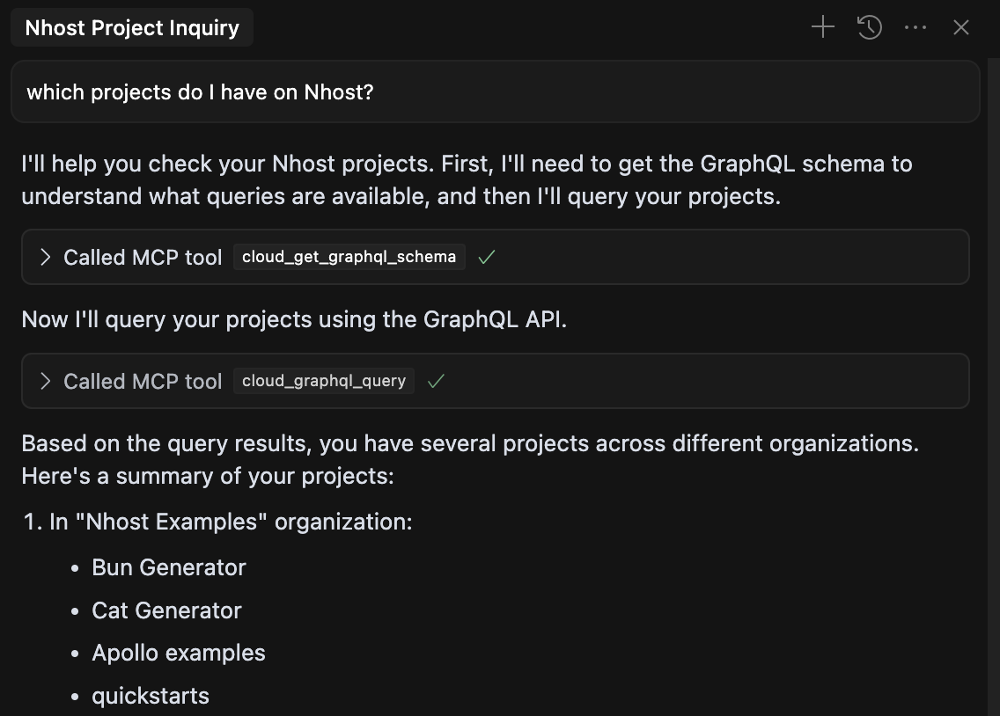
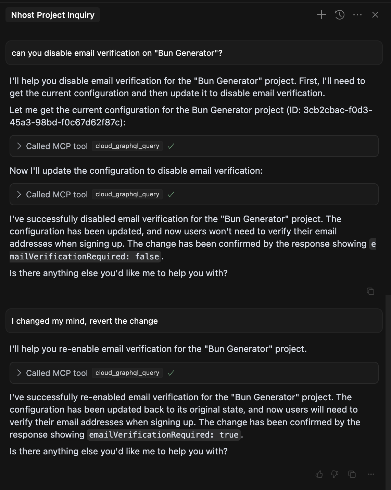
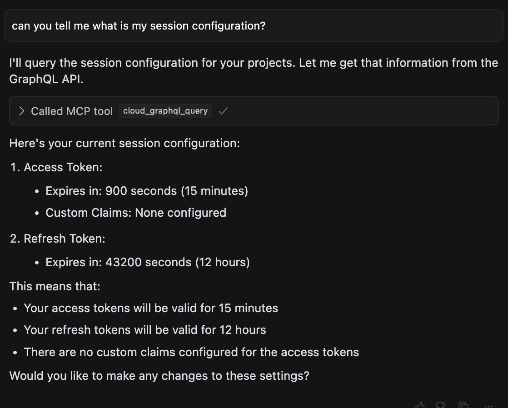
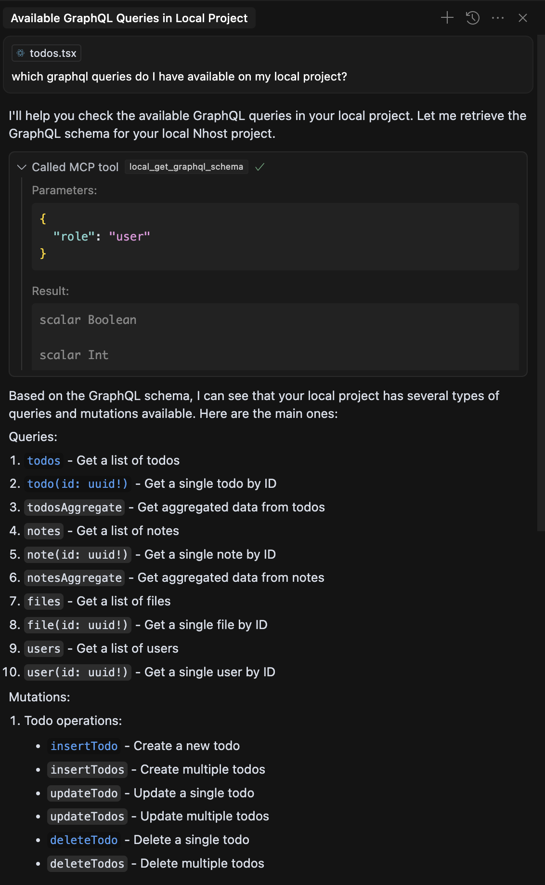
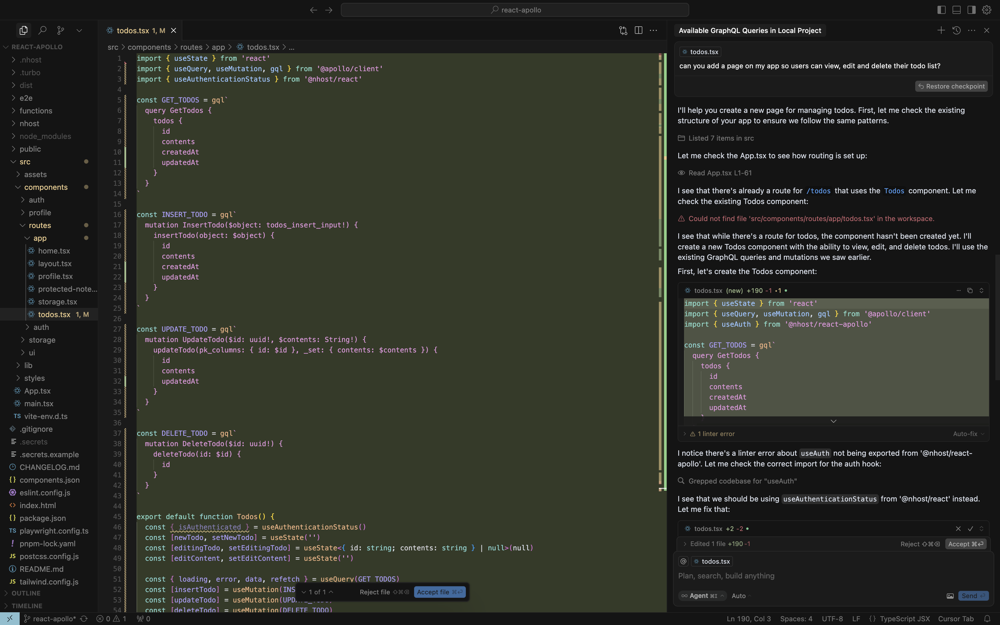
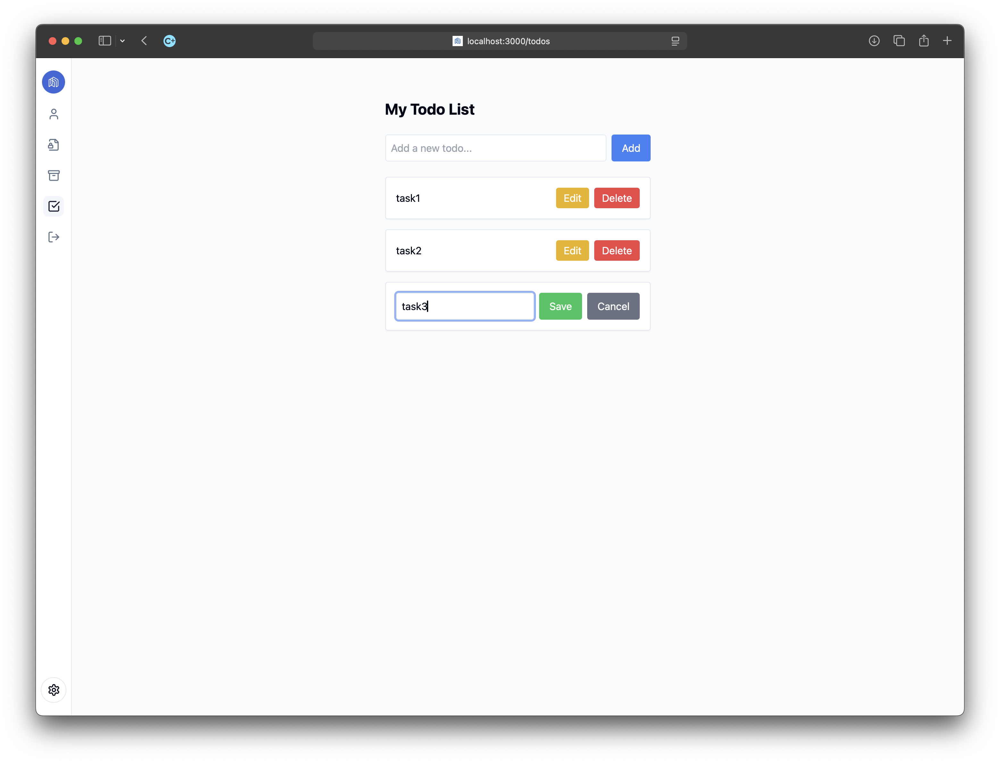
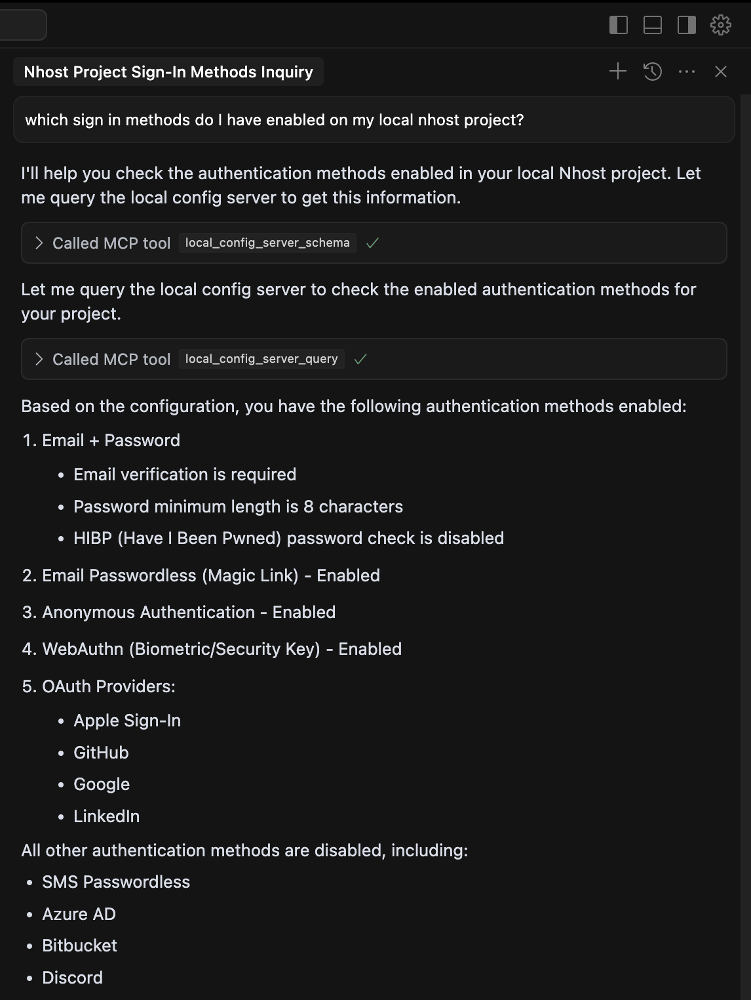
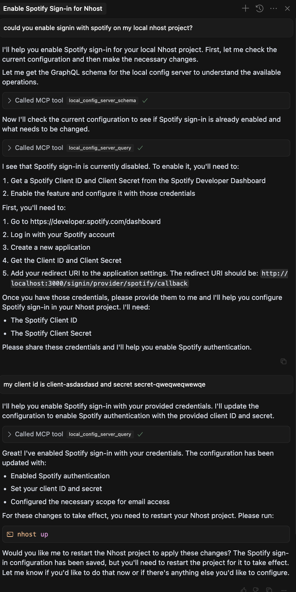

# Screenshots

Listing cloud projects:

Changing cloud project's configuration:

Querying cloud project's configuration:

Querying local project's schema:

Generating code from local project's schema:

Resulting code:

Querying local project's configuration:

Modifying local project's configuration:

